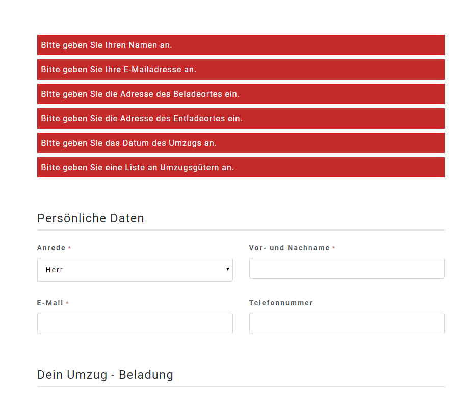

# Vivalidator

> A simple and easy input and data validation library

## Why?

I dislike the way of using Wordpress Plugins or heavy PHP packages for form development when it comes to Wordpress forms. I hate when third party code adds markup to your page or narrows my possibilites because of some restrictions coming with the external code. Thats why I started looking for easy to use validation frameworks but didn't find anything that perfectly fits my needs. This is why I started development on Vivalidator.

## Installation

#### The Composer Way

Run `composer require bdbch/vivalidator` in your project folder to install Vivalidator via Composer. It will be automatically placed into your autoload.

#### Manual Way

Make sure to have all necessary files copied manually into your project. Require the desired library from the `src` folder in your code to get access to a Vivalidator Class.

## Usage

Using the Validator is simple. Check out this example code to get an idea on how to use this feature.

```php
<?php

// Make sure to use the feature in your component
use Vivalidator\Validator;

// Data to validate. I left the job empty on purpose to demonstrate non-valid data
$data = [
  'name' => 'Peter',
  'age' => '23',
  'job' => ''
];

// Validator Options / Rules
// Each field can have multiple rules with their own error messages
$options = [
  'name' => [
    [
      'rule' => 'empty',
      'message' => 'Please enter your name'
    ],
    [
      'rule' => 'minlength',
      'value' => 3,
      'message' => 'Your name needs to be longer than 3 characters.'
    ]
  ],
  'age' => [
    [
      'rule' => 'empty',
      'message' => 'Please enter your age'
    ],
    [
      'rule' => 'min',
      'value' => 1,
      'message' => 'You need to be older than 1'
    ],
    [
      'rule' => 'max',
      'value' => 150,
      'message' => 'I would love to believe you, but I will not'
    ]
  ],
  'job' => [
    [
      'rule' => 'empty',
      'message' => 'Please specify your job'
    ]
  ]
];

// Create a new validator instance and pass data and options in
$validator = new Validator($data, $options);

// Errors will be collected in an array.
// If there are no errors, it will be an empty string
if (count($validator->errors)) {
  echo 'You have ' . count($validator->errors) . ' errors in your submission.';
} else {
  echo 'All set, lets submit!';
}

// Thats it
// You can now do what ever you want with the submitted data
// Make sure to escape the data. The validator doesn't do this right now
// TODO: This will be a feature so fields can be escaped if needed
```

## Rules

* `empty` - This checks if the submitted field is empty or not filled
* `minlength` - This checks if the submitted fields content is longer than a specific value
* `maxlength` - This checks if the submitted fields content is lower than a specific value
* `mail` - This checks if the submitted fields are valid emails
* `url` - This checks if the value is an URL

#### Planned Rules
See [this issue](https://github.com/bdbch/flynt-validator/issues/1) to learn more

## Contribution

I'm open for pull requests and would love to see some support. I'm not the 100% best PHP developer and would love to get this Flynt feature even better so we're not bound to damn Wordpress Plugins anymore.

## License

This is licensed under the MIT license.
